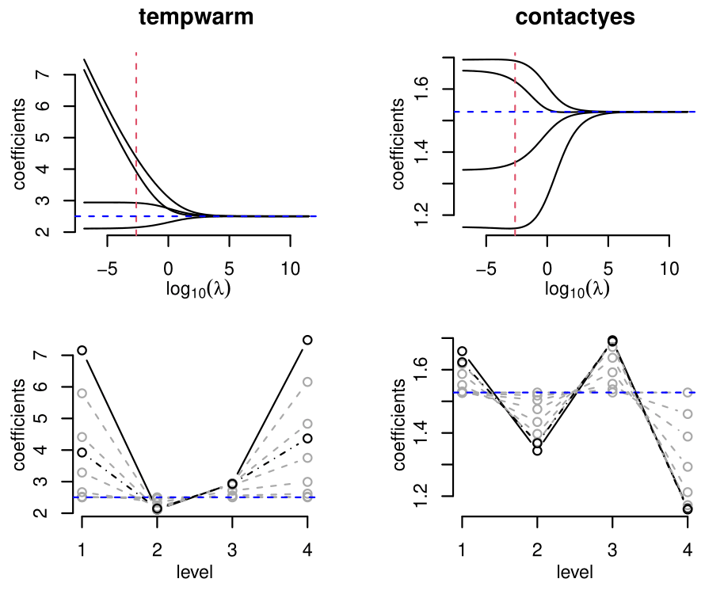

<!-- README.md is generated from README.Rmd. Please edit that file -->

```{r, include = FALSE}
knitr::opts_chunk$set(
  collapse = TRUE,
  comment = "#>",
  fig.path = "man/figures/README-",
  out.width = "100%"
)
```


# serp 

<!-- badges: start -->

[](https://www.repostatus.org/#active)
[](https://codecov.io/gh/ejikeugba/serp?branch=master)
[](https://CRAN.R-project.org/package=serp)
[](https://github.com/ejikeugba/serp/actions)
[](https://www.gnu.org/licenses/gpl-2.0.en.html)
[](https://ci.appveyor.com/project/ejikeugba/serp)

<!-- badges: end -->


Smooth Effects on Response Penalty for CLM

A regularization method for the cumulative link models (CLM). The 'serp' function applies the 'smooth-effect-on-response penalty' (SERP) on the estimates of the general CLM, enabling all subject-specific effects associated with each variable in the model to shrink towards a unique global effect. Fitting is done using a modified Newton's method (Ugba et al., 2021; Tutz and Gertheiss, 2016).

## Example
Consider the cumulative logit model of the wine dataset, where the rating of wine bitterness is predicted with the two treatment factors, temperature and contact.

```{r }
require(serp)
```


* The unpenalized non-proportional odds model returns unbounded parameter estimates.

```{r }
require(serp)
m1 <- serp(rating ~ temp + contact, slope = "unparallel",
           reverse = TRUE, link = "logit", data = wine)
summary(m1)
``` 


* Using SERP with the deviance tuning, for instance,  returns the model along parameter shrinkage at which the total residual deviance is minimal and stable parameter estimates too.
```{r }

m2 <- serp(rating ~ temp + contact, slope = "penalize",
           reverse = TRUE, link = "logit", tuneMethod = "deviance",
           data = wine)
summary(m2)
```


* A user-supplied discrete lambda grid could be used for the deviance or the cv tuning method.
```{r }
m3 = serp(rating ~ temp + contact, slope = "penalize",
          reverse = TRUE, link = "logit", tuneMethod = "deviance",
          lambdaGrid = 10^seq(10, -2, length.out=10), data = wine)
head(predict(m3, type='response'))
```


* A penalized partial proportional odds model is obtained by setting one or variables as global effect(s).
```{r }
m4 <- serp(rating ~ temp + contact, slope = "penalize",
           reverse = TRUE, link = "logit", tuneMethod = "deviance",
           globalEff = ~ temp, data = wine)
coef(m4)
```


* The Figure below shows the coefficient paths (row1) and the smoothing steps (row2) for the ordinal model of the wine data using SERP. The dashed horizontal (blue) and vertical (red) lines denote the parallel estimates and the selected estimates based on the minimum deviance, respectively.




## Installation:
You can install the released version of serp  from [CRAN](https://cran.r-project.org/package=serp) with:

``` r
install.packages("serp")
```

And the development version from [GitHub](https://github.com/ejikeugba/serp) with:

``` r
# install.packages("devtools")
devtools::install_github("ejikeugba/serp")
```


## Loading:
```{r, eval = FALSE}
library(serp)
```


## References:
Ugba, E. R., Mörlein, D. and Gertheiss, J. (2021). Smoothing in Ordinal            Regression: An Application to Sensory Data. *Stats*, 4, 616–633.
     https://doi.org/10.3390/stats4030037

Tutz, G. and Gertheiss, J. (2016). Regularized Regression
     for Categorical Data (With Discussion and Rejoinder).
     *Statistical Modelling*, 16, 161-260.
     https://doi.org/10.1177/1471082X16642560


