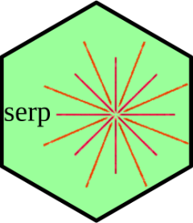

<!-- README.md is generated from README.Rmd. Please edit that file -->

```{r, include = FALSE}
knitr::opts_chunk$set(
  collapse = TRUE,
  comment = "#>",
  fig.path = "man/figures/README-",
  out.width = "100%"
)
```


# serp 

<!-- badges: start -->
[](https://www.repostatus.org/#active)
[](https://app.codecov.io/gh/ejikeugba/serp?branch=master)
[](https://CRAN.R-project.org/package=serp)
[](https://CRAN.R-project.org/package=serp)
[](https://www.gnu.org/licenses/gpl-2.0.en.html)
[](https://ci.appveyor.com/project/ejikeugba/serp)
[](https://github.com/ejikeugba/serp/actions)
[](https://doi.org/10.21105/joss.03705)
<!-- badges: end -->


### Overview
`serp`fits cumulative link models (CLMs) with the `smooth-effect-on-response penalty (SERP)`. The `cumulative model` developed by McCullagh (1980) is probably the most frequently used ordinal model in empirical studies. However, the stochastic ordering property of the general form of the model poses a very serious challenge in most empirical applications of the model. For instance, unstable likelihoods with ill-conditioned parameter space are frequently encountered during the iterative process. `serp` implements a unique regularization method for CLMs that provides the means of smoothing the adjacent categories in the model. At extreme shrinkage, SERP causes all subject-specific effects associated with each variable in the model to shrink towards unique global effects. Fitting is done using a modified Newton's method. Several standard model performance and descriptive methods are also available. See [Ugba, 2021](https://doi.org/10.21105/joss.03705), [Ugba et al., 2021](https://doi.org/10.3390/stats4030037) and [Tutz and Gertheiss, 2016](https://doi.org/10.1177/1471082X16642560) for further details on the implemented penalty.


### Example
Consider the cumulative logit model of the [wine dataset](https://ejikeugba.github.io/serp/reference/wine.html), where the rating of wine bitterness is predicted with the two treatment factors, temperature and contact.

```R
## The unpenalized non-proportional odds model returns unbounded estimates, hence,
## not fully identifiable.
f1 <- serp(rating ~ temp + contact, slope = "unparallel",
           reverse = TRUE, link = "logit", data = wine)
coef(f1)
```

```R
## The penalized non-proportional odds model with a user-supplied lambda gives 
## a fully identified model having bounded estimates. A suitable tuning criterion
## could as well be used to select lambda (e.g., aic or cv) 
f2 <- serp(rating ~ temp + contact, slope = "penalize",
           link = "logit", reverse = TRUE, tuneMethod = "user",
           lambda = 1e1 ,data = wine)
coef(f2)
```

```R
## A penalized partial proportional odds model with one variable set to 
## global effect is also possible.
f3 <- serp(rating ~ temp + contact, slope = "penalize",
           reverse = TRUE, link = "logit", tuneMethod = "user",
           lambda = 2e1, globalEff = ~ temp, data = wine)
coef(f3)
```

```R
## The unpenalized proportional odds model with constrained estimates. 
## Under estreme shrinkage, estimates in f2 equal those in this model.  
f4 <-  serp(rating ~ temp + contact, slope = "parallel",
            reverse = FALSE, link = "logit", data = wine)
summary(f4)
```

### Installation and Use

Before installing `serp`, it is encouraged to have a recent version of [R](https://cran.r-project.org/bin/windows/base/) installed. The released version of `serp` can be installed from [CRAN](https://cran.r-project.org/package=serp) with:

``` r
install.packages("serp")
```

or the development version from [GitHub](https://github.com/ejikeugba/serp) with:

``` r
if (!require("devtools")) install.packages("devtools")
devtools::install_github("ejikeugba/serp")
```

Load `serp` into R environment with:
```{r, eval = FALSE}
library(serp)
```


### Community Guidelines

Pull requests are welcomed! Please submit your contributions to `serp` through the list of `Pull Requests`, following the [contributing guidelines](https://ejikeugba.github.io/serp/CONTRIBUTING.html). To report issues and/or seek support, please file a new ticket in the [issue](https://github.com/ejikeugba/serp/issues) tracker, and expect a feedback ASAP! 


### Code of Conduct

Please note that `serp` is released with a [Contributor Code of Conduct](https://github.com/ejikeugba/serp/blob/master/CODE_OF_CONDUCT.md). By contributing to this project, you agree to abide by its terms.


### References
McCullagh, P. (1980). Regression Models for Ordinal Data. *Journal of the Royal Statistical Society. Series B (Methodological)*, 42, 109-142. https://doi.org/10.1111/j.2517-6161.1980.tb01109.x 

Randall, J (1989). The analysis of sensory data by generalized linear model. *Biometrical Journal*, 31, 781--793. https://doi.org/10.1002/bimj.4710310703

Tutz, G. and Gertheiss, J. (2016). Regularized Regression for Categorical Data (With Discussion and Rejoinder).  *Statistical Modelling*, 16, 161-260. https://doi.org/10.1177/1471082X16642560

Ugba, E. R., Mörlein, D. and Gertheiss, J. (2021). Smoothing in Ordinal Regression: An Application to Sensory Data. *Stats*, 4, 616–633. https://doi.org/10.3390/stats4030037

Ugba, E. R. (2021). serp: An R package for smoothing in ordinal regression *Journal of Open Source Software*, 6(66), 3705. https://doi.org/10.21105/joss.03705
